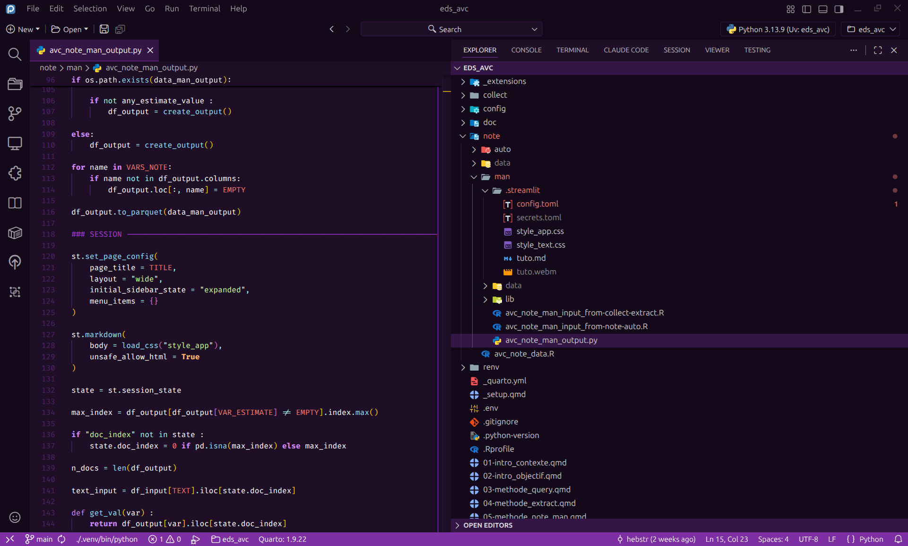

# Material Night Purple

A dark purple theme for VSCode and Positron, inspired by [Material Night Eighties](https://open-vsx.org/extension/ms-vscode/Theme-MaterialKit). Includes Positron-specific styling (console, variables pane, data explorer).



## Installation

### From Open VSX (Positron / VSCode)

Search for **Material Night Purple** in the Extensions panel, or install from the command line:

```bash
code --install-extension hebstr.material-night-purple
```

### From source

```bash
git clone https://github.com/hebstr/material-night-purple.git
cd material-night-purple
npx @vscode/vsce package
code --install-extension material-night-purple-*.vsix
```

## Palette

### UI colors

| Role             | Color                                                                    |
| ---------------- | ------------------------------------------------------------------------ |
| Deep background  |  `#14091b` (bg_1)   |
| Background       |  `#1e0e26` (bg_2)   |
| Surface          |  `#341646` (bg_3)   |
| Subtle purple    |  `#4f2268`          |
| Purple accent    |  `#7d2fa3`          |
| Purple bright    |  `#a73bde`          |
| Purple light     |  `#d08aff`          |
| Cursor           |  `#ffdd00`          |

### Syntax colors

| Role     | Color                                                                    |
| -------- | ------------------------------------------------------------------------ |
| Comments |  `#a73bde`          |

> **Note**: Only comments have custom syntax highlighting. All other token colors inherit from the editor's built-in defaults or user customization.

## Customization

The theme is generated from `build.js`, where colors are defined as a palette. To tweak the theme:

1. Edit the palette or token rules in `build.js`
2. Run `node build.js`
3. Reload the window

## License

[MIT](LICENSE.md)
